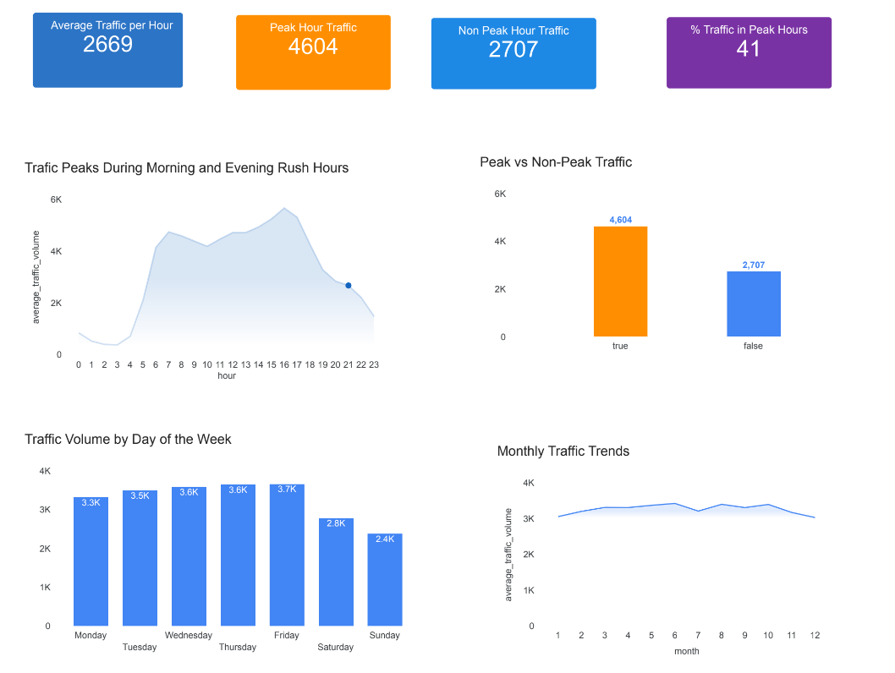

# Passenger Flow & Congestion Analysis

## Business Objective
Analyze passenger traffic patterns to identify peak congestion periods and support operational decision-making for transport hubs.

## 📊 Dataset
- 48,000+ traffic records
- Features engineered: hour, month, day_of_week, is_peak_hour
- Data cleaned and transformed before analysis

## Key Questions
- What are the peak hours and peak days for passenger traffic?
- How does traffic vary by day of the week?
- Are there seasonal traffic patterns?
- Which time periods represent the highest congestion risk?

## 📊 Key Insights

- Traffic volume is highest during peak commuting hours (morning and late afternoon), confirming strong work-related travel patterns.
- Weekday traffic levels are significantly higher than weekends, indicating reduced commercial and commuter activity on Saturdays and Sundays.
- Monthly trends show higher traffic volumes during warmer months, suggesting seasonal travel increases.
- A large percentage of total traffic occurs during defined peak hours, highlighting congestion pressure during commuting periods.

## Key Performance Indicators (KPIs)
- Average traffic volume per hour
Traffic volume peaks at around 16:00 with an average of approximately 5,663 vehicles, indicating the busiest period of the day. Traffic is lowest during late-night and early-morning hours.

  
- Peak vs non-peak traffic volume
Average traffic during peak hours is about 4,603 vehicles, compared to 2,707 during non-peak hours, showing a significant increase in road usage during commuting periods.

  
- Traffic volume by day of week
Traffic is highest on Friday with an average of 3,656 vehicles, while the lowest traffic occurs on Sunday, suggesting reduced travel activity during weekends.

  
- Traffic volume by month
Monthly analysis shows that traffic volume tends to increase during June and decrease during December, indicating seasonal travel patterns.

  
- Percentage of traffic during peak hours
Approximately 41% of total traffic occurs during peak hours, highlighting the concentration of road usage within limited time windows.

## 🛠 Tools Used
- Google Sheets (initial cleaning)
- BigQuery (SQL analysis & KPI calculations)
- Tableau / Looker Studio (dashboard visualization)

## 📷 Dashboard Preview

---

## 📁 Project Structure

traffic-flow-analysis/
│
├── data/
├── sql/
├── dashboard/
└── README.md

---

## 👤 Author
Van Serick Bouanga Latchybou  
Google Data Analytics Certified  
SQL | BigQuery | Data Visualization

